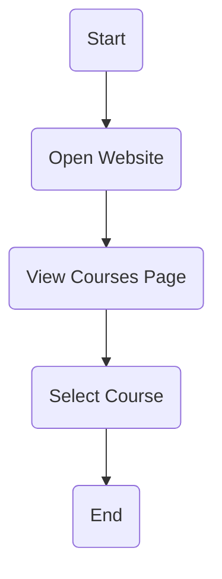
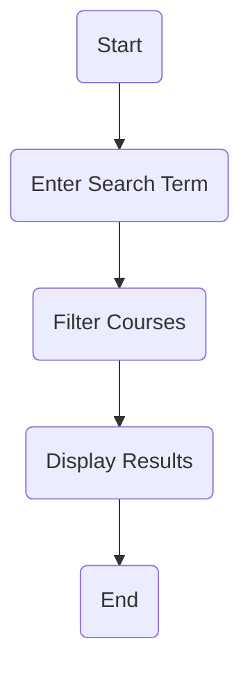
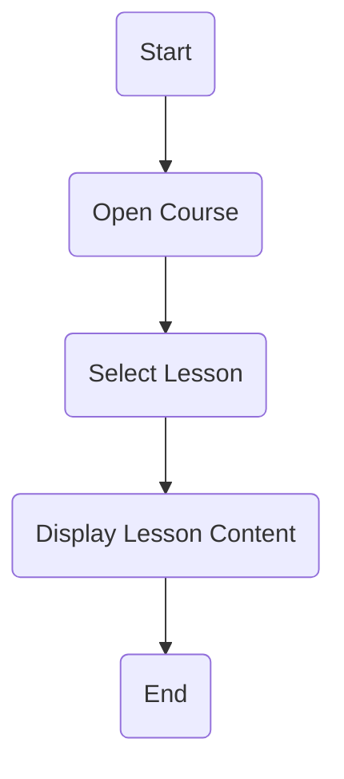
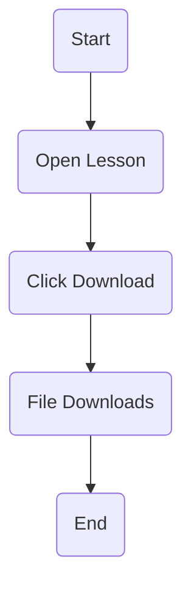
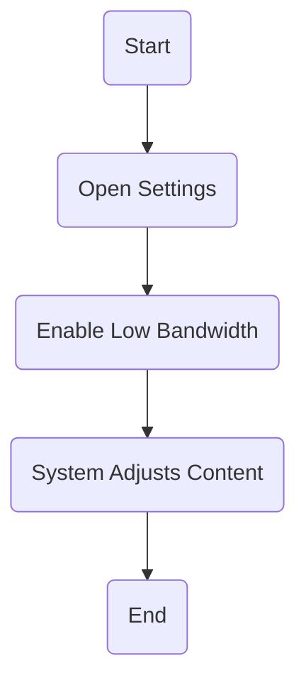
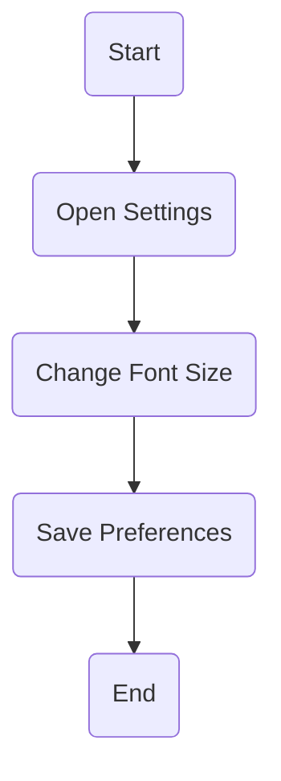
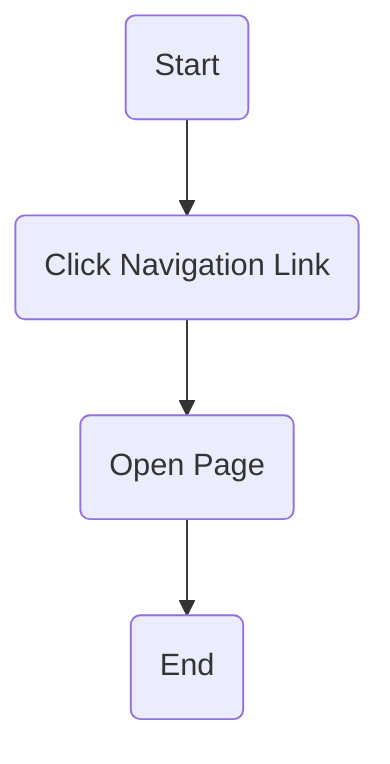
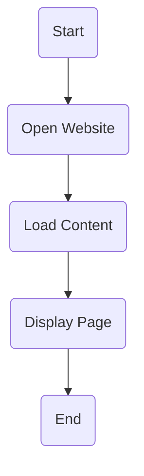

# Activity Diagrams – AccessLearn

## Overview

These diagrams model workflows and processes within the system.

---

## 1. Browse Courses

### Explanation

Allows users to discover available learning content.

---

## 2. Search Courses

### Explanation

Supports fast content discovery, improving usability.

---

## 3. View Lesson

### Explanation

Represents how users access learning materials.

---

## 4. Download Notes

### Explanation

Supports offline learning in low-bandwidth environments.

---

## 5. Enable Low-Bandwidth Mode

### Explanation

Reduces data usage, addressing digital divide challenges.

---

## 6. Change Font Size

### Explanation

Improves accessibility for different users.

---

## 7. Navigation Workflow

### Explanation

Ensures simple and intuitive movement between pages.

---

## 8. System Load

### Explanation

Represents system performance and responsiveness.

---

## Traceability

These workflows support:

* Functional Requirements (Assignment 4)
* User Stories (Assignment 6)
* Sprint Tasks (Assignment 6)
