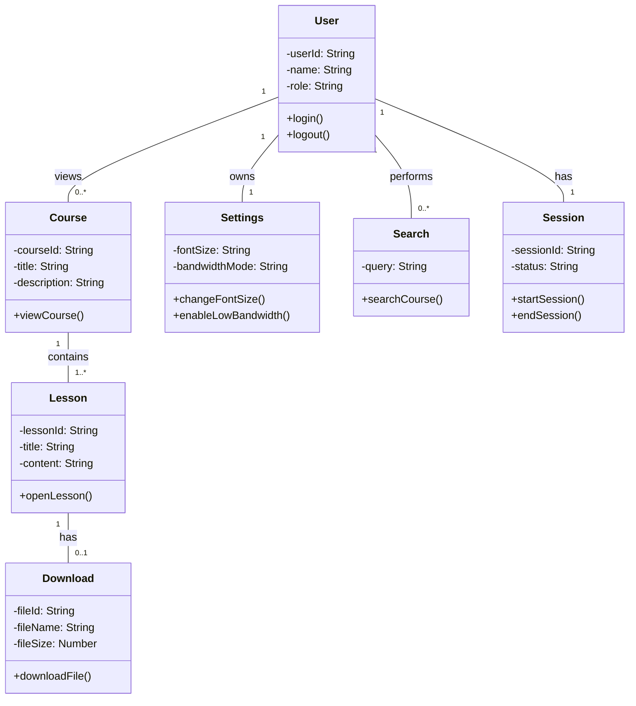

# Class Diagram – AccessLearn

## Mermaid Class Diagram

---

## Explanation of Design

* The **User class** is the central entity interacting with all other components.
* A **Course contains multiple Lessons**, reflecting structured learning.
* A **Lesson may have a Download**, supporting offline learning.
* **Settings are linked to a single user**, ensuring personalization.
* **Session tracks user activity**, aligning with system interaction tracking.
* **Search enables course discovery**, improving usability.

The design focuses on simplicity and scalability, making it suitable for a lightweight system.
