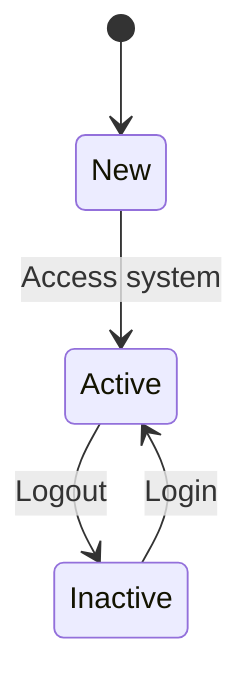
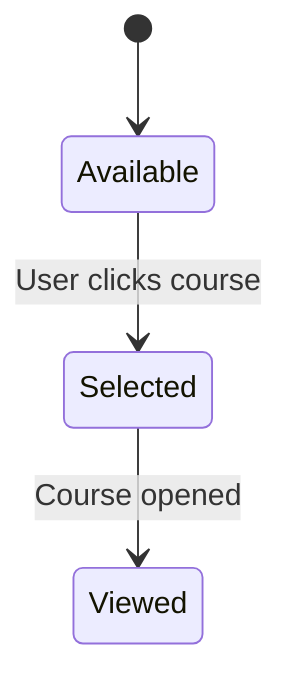
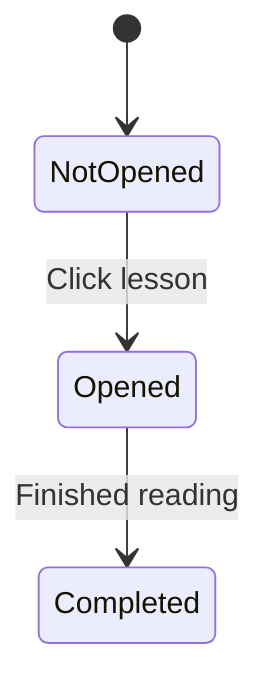
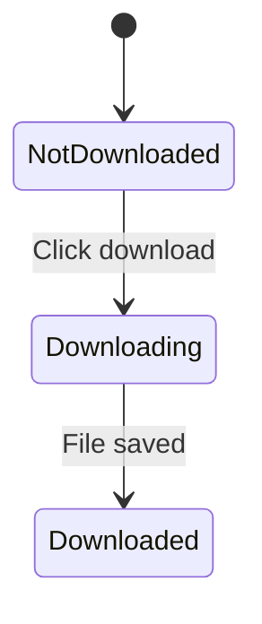
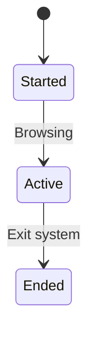
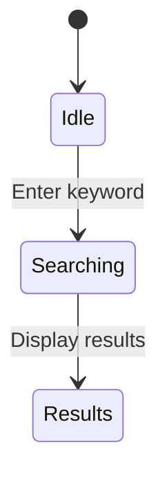

# State Transition Diagrams – AccessLearn

## Overview

These diagrams model how key system objects change state over time in response to user actions and system events.

---

## 1. User State



### Explanation

The user begins in a "New" state and becomes "Active" when using the platform. Logging out moves the user to "Inactive". This supports system access and usage.

---

## 2. Course State



### Explanation

Courses are initially available. When selected and opened, they move to a viewed state. This aligns with browsing and viewing functionality.

---

## 3. Lesson State



### Explanation

Lessons move through stages of interaction, supporting the learning process from access to completion.

---

## 4. Download State



### Explanation

This supports offline learning by enabling students to download notes.

---

## 5. Settings State

```mermaid
stateDiagram-v2
    [*] --> Default
    Default --> Modified : User changes settings
    Modified --> Saved : Stored in LocalStorage
```

### Explanation

Settings allow users to adjust font size and enable low-bandwidth mode.

---

## 6. Session State



### Explanation

Tracks user interaction during a session.

---

## 7. Search State



### Explanation

Supports quick navigation and finding courses efficiently.

---

## Traceability

These diagrams support:

* Functional Requirements: course viewing, lesson access, downloads, settings
* User Stories: US-001 to US-005 from Assignment 6
